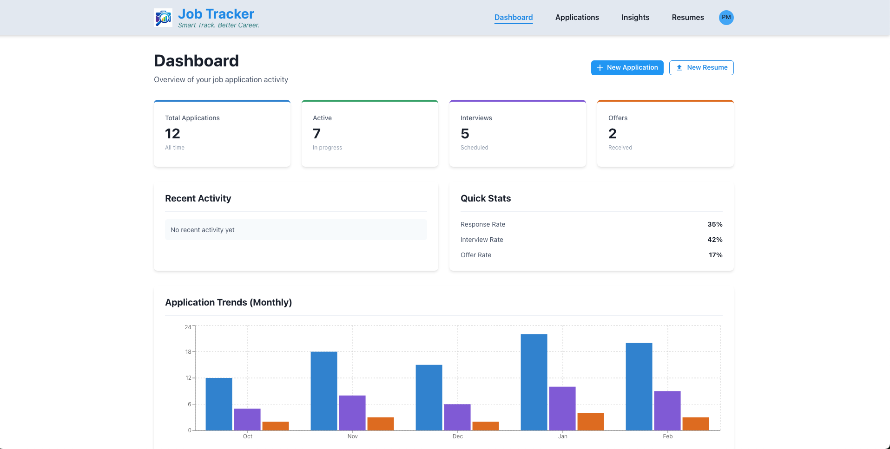
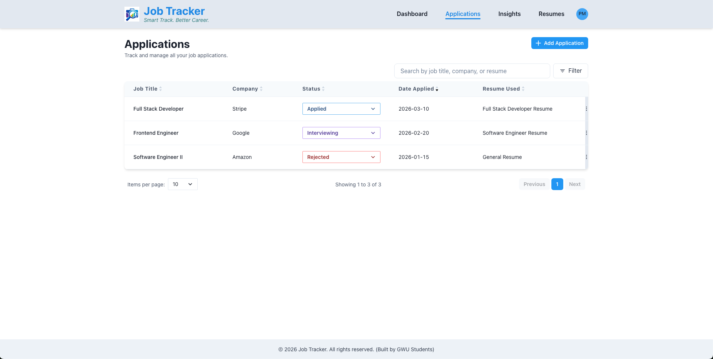
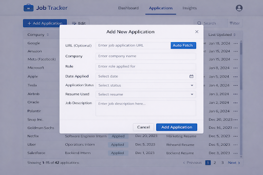
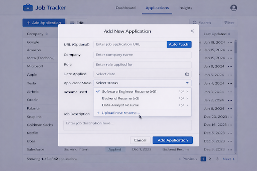
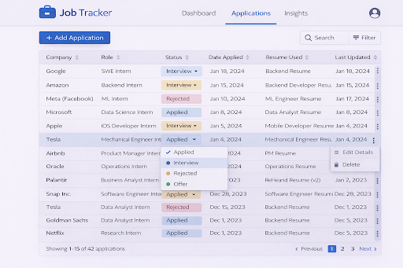
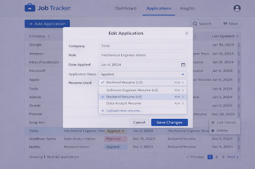
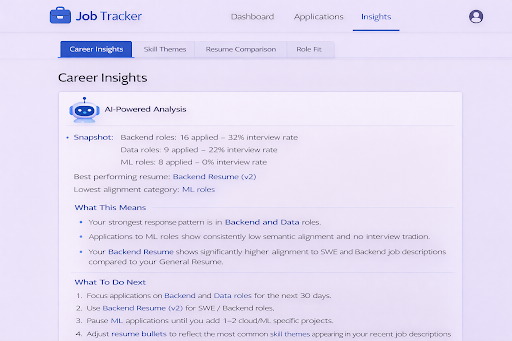
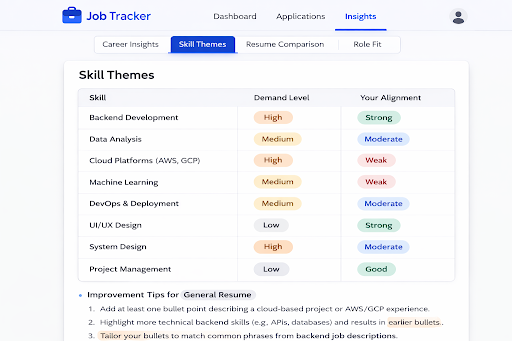
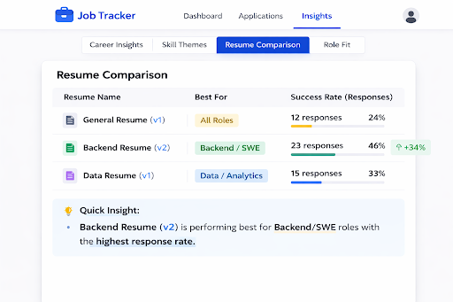
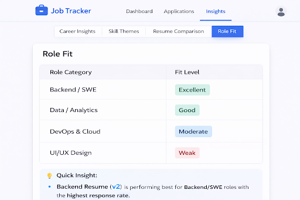

# Job-Tracker Frontend

This document defines the **frontend architecture, project structure, styling strategy, and development standards** for the Job-Tracker application.

The frontend is built using:

* React + TypeScript
* Vite
* Chakra UI
* CSS Modules (`*.module.css`)
* React Hook Form (form handling)
* Recharts (data visualization)

Location: `/frontend`

---

# Tech Stack

## Core

* **React + TypeScript** – Component-based UI library with static typing
* **Vite** – Fast development server and optimized build tool

## UI & Styling

* **Chakra UI** – Accessible and responsive component system
* **CSS Modules** – Scoped component-level styling

## Routing & State

* **React Router DOM** – Declarative routing for multi-page SPA
* **State Management (Optional)** – Zustand / Redux for global state

## Forms

* **React Hook Form** – Simple and performant form handling

## Charts

* **Recharts** – Data-driven SVG visualizations

## API Communication

* **fetch** (built-in) – Used for all HTTP requests
* **API contract**: `docs/API_CONTRACT.md` (source of truth)

---

# Project Structure

```text
frontend/
├── public/                                  # Static files (no bundling)
│   ├── favicon.svg
│   └── logo.svg
│
├── src/
│   ├── vite-env.d.ts                        # Vite environment types
│   │
│   ├── app/                                 # Application bootstrap
│   │   ├── main.tsx                         # React entry point
│   │   ├── App.tsx                          # Root component
│   │   ├── App.module.css                   # App styles
│   │   └── routes/
│   │       └── index.tsx                    # Route configuration
│   │
│   ├── features/                            # Feature modules
│   │   ├── analytics/                       # Analytics feature
│   │   │   ├── types.ts
│   │   │   ├── pages/
│   │   │   │   ├── AnalyticsPage/
│   │   │   │   │   └── AnalyticsPage.tsx
│   │   │   │   └── InsightsPage/
│   │   │   │       └── InsightsPage.tsx
│   │   │   └── services/
│   │   │       └── analytics.service.ts
│   │   │
│   │   ├── applications/                    # Job applications feature
│   │   │   ├── types.ts
│   │   │   ├── pages/
│   │   │   │   └── ApplicationsPage/
│   │   │   │       └── ApplicationsPage.tsx
│   │   │   └── services/
│   │   │       └── applications.service.ts
│   │   │
│   │   ├── dashboard/                       # Dashboard feature
│   │   │   ├── types.ts
│   │   │   ├── pages/
│   │   │   │   └── DashboardPage/
│   │   │   │       └── DashboardPage.tsx
│   │   │   └── services/
│   │   │       └── dashboard.service.ts
│   │   │
│   │   ├── insights/                        # Insights feature
│   │   │   ├── types.ts
│   │   │   ├── pages/
│   │   │   │   └── InsightsPage/
│   │   │   │       └── InsightsPage.tsx
│   │   │   └── services/
│   │   │       └── insights.service.ts
│   │   │
│   │   └── resume/                          # Resume feature
│   │       └── pages/
│   │           └── ResumesPage/
│   │               └── ResumesPage.tsx
│   │
│   ├── shared/                              # Shared utilities
│   │   ├── components/
│   │   │   └── PagePlaceholder/
│   │   │       └── PagePlaceholder.tsx
│   │   ├── hooks/
│   │   │   └── useDebounce.ts               # Debounce hook
│   │   ├── layout/
│   │   │   ├── Footer/
│   │   │   │   └── Footer.tsx               # Footer component
│   │   │   └── Navbar/
│   │   │       └── Navbar.tsx               # Navigation component
│   │   ├── lib/
│   │   │   └── apiClient.ts                 # Fetch API wrapper
│   │   ├── types/
│   │   │   └── index.ts                     # Global types
│   │   └── utils/
│   │       └── index.ts                     # Utility functions
│   │
│   └── styles/                              # Global styles
│       ├── index.css                        # Global CSS
│       └── theme.ts                         # Chakra UI theme
│
├── index.html                               # Entry HTML file (Vite injects scripts here)
├── .env.example
├── README.md
├── INITIAL_SETUP.md
├── .eslintrc.cjs
├── .prettierrc
├── tsconfig.json
├── vite.config.ts
└── package.json
```

# Styling Strategy

* **Chakra UI** for base components and theming
* **CSS Modules** for component/page-specific styles
* Global styles are minimal (`styles/global.css`)

---

# Form Handling Example (React Hook Form + TypeScript)

```tsx
import { useForm, SubmitHandler } from "react-hook-form";

interface JobFormInputs {
  jobTitle: string;
  company: string;
}

export const JobForm: React.FC = () => {
  const { register, handleSubmit } = useForm<JobFormInputs>();

  const onSubmit: SubmitHandler<JobFormInputs> = data => {
    console.log(data);
  };

  return (
    <form onSubmit={handleSubmit(onSubmit)}>
      <input {...register("jobTitle")} placeholder="Job Title" />
      <input {...register("company")} placeholder="Company" />
      <button type="submit">Submit</button>
    </form>
  );
};
```

---

# Chart Example (Recharts + TypeScript)

```tsx
import { LineChart, Line, XAxis, YAxis, Tooltip, CartesianGrid } from "recharts";

const data = [
  { date: "2026-01-01", jobs: 10 },
  { date: "2026-01-02", jobs: 20 },
  { date: "2026-01-03", jobs: 15 },
];

export const JobsChart: React.FC = () => (
  <LineChart width={400} height={200} data={data}>
    <CartesianGrid stroke="#ccc" />
    <XAxis dataKey="date" />
    <YAxis />
    <Tooltip />
    <Line type="monotone" dataKey="jobs" stroke="#8884d8" />
  </LineChart>
);
```

---

# Naming Conventions

* **camelCase** for variables, functions, props, and API fields
* Follow `docs/API_CONTRACT.md` for API consistency

---
# Core Features

## Dashboard



## Applications







## Insights






---

# Local Development

## Tech Stack Installed

- [x] React 18.2 + TypeScript 5.3
- [x] Vite 5.0 (dev server & build tool)
- [x] Chakra UI 2.8 (component library)
- [x] React Router DOM 6.21 (routing)
- [x] React Hook Form 7.49 (forms)
- [x] Recharts 2.10 (charts)

```bash
cd frontend
npm install
npm run dev
```

Default: `http://localhost:5173`

---

# Backend Integration

Expected backend: `http://localhost:8000`

Optional proxy in `vite.config.ts`:

```ts
server: {
  proxy: {
    "/api": "http://localhost:8000"
  }
}
```

---

# Code Quality Recommendations

* ESLint + Prettier
* Small, focused components
* Keep business logic in hooks
* API calls only in services

---

# Production Build

```bash
npm run build
```

Output directory: `/dist`

---

# Summary

This frontend is:

* **TypeScript-first**
* **Folder-per-component/page**, with `.tsx`, `.types.ts`, `.module.css`
* Feature-based and scalable
* Uses Chakra UI + CSS Modules
* Forms handled via React Hook Form
* Charts rendered via Recharts
* Clean, maintainable, and production-ready
