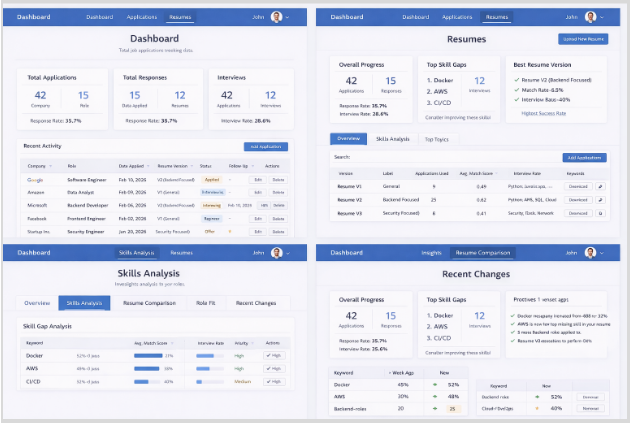
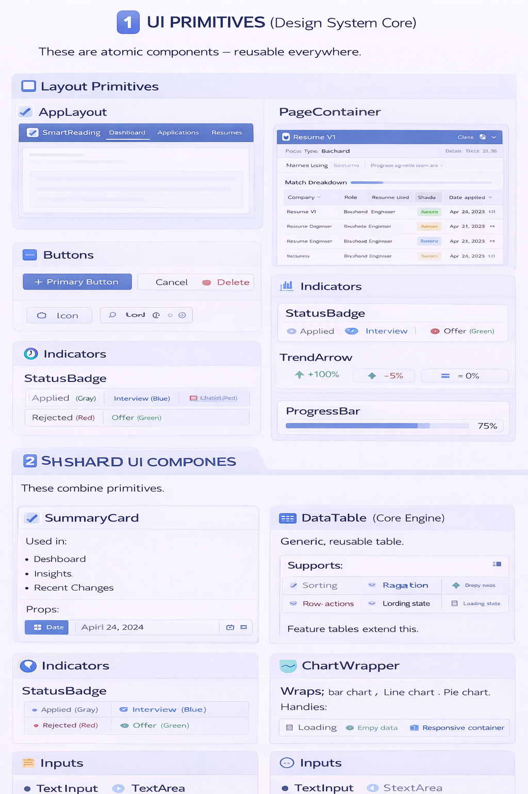

# 🚀 Job Application Tracker

A scalable, production-ready frontend architecture for a modern job application tracking system.

Built with:

- ⚛️ React  
- 🧠 TypeScript
- 💠 Chakra UI
- 🔄 TanStack Query (React Query)  
- 🧾 React Hook Form  
- 🛡 Zod  
- 🗄 Supabase (Database + Storage + Edge Functions)

---

# 📐 Architecture Overview

This project follows a **layered architecture pattern** to ensure scalability, maintainability, and clear separation of concerns.

```
UI Primitives
↓
Shared UI Components
↓
Feature Components
↓
Page Containers
↓
Data Hooks
↓
Services Layer
```

This structure ensures:

- Clear responsibility boundaries  
- High reusability  
- Predictable data flow  
- Strong typing & validation  
- Backend-driven analytics  
- Scalable feature growth  

---

# 🏗 Architecture Layers

---

## 1️⃣ UI Primitives (Design System Core)

Atomic, reusable components used throughout the application.

## 🔎 Design Preview




### 🎨 Layout Primitives

- `AppLayout`
- `PageContainer`
- `SectionCard`

### 🔘 Buttons

- `PrimaryButton`
- `SecondaryButton`
- `DangerButton`
- `IconButton`

### 📊 Indicators

- `StatusBadge`
- `TrendArrow`
- `ProgressBar`

### 📥 Form Inputs

All integrated with **React Hook Form** and validated using **Zod**:

- `TextInput`
- `TextArea`
- `SelectDropdown`
- `SearchInput`
- `DatePicker`
- `Checkbox`

---

## 2️⃣ Shared UI Components

Composed from UI primitives and reused across features.

### 📦 SummaryCard

Used in Dashboard, Insights, and Recent Changes.

```ts
{
  title: string
  value: string | number
  subtext?: string
  trend?: number
  icon?: ReactNode
}
```

Displays:

- Large metric value  
- Optional trend arrow  
- Supporting text  

---

### 📊 DataTable (Core Engine)

Reusable generic table component.

Supports:

- Sorting  
- Pagination  
- Row actions  
- Empty state  
- Loading skeleton  
- Custom cell renderers  

All feature-specific tables extend this.

---

### 📈 ChartWrapper

Wrapper around chart libraries.

Supports:

- Bar charts  
- Line charts  
- Pie charts  
- Responsive container  
- Loading state  
- Empty state  
- Title & legend  

---

## 3️⃣ Feature Modules

---

# 🟦 Dashboard

### Components

- `DashboardSummaryRow`
- `RecentActivityTable`
- `QuickActionsPanel`

### Metrics

- Total applications  
- Interviews count  
- Response rate  

Example query:

```sql
SELECT *
FROM applications
JOIN resumes ON resumes.id = applications.resume_id
ORDER BY date_applied DESC
LIMIT 10;
```

---

# 🟩 Applications Page

### Components

- `ApplicationsFilters`
- `ApplicationsTable`
- `ApplicationModal`

### Features

- Debounced search  
- Filter by status / role type / resume  
- Optimistic updates  
- Backend match score calculation  
- Zod schema validation  

---

# 🟨 Resumes Page

### Components

- `UploadResumeButton`
- `ResumesTable`
- `ResumeDetailDrawer`

### Features

- Upload to Supabase Storage  
- Edge Function resume parsing  
- Processing spinner  
- Aggregated performance metrics  
- Skill extraction display  

---

# 🟪 Insights Page (Analytics Layer)

⚠️ Heavy analytics are computed on the backend only.

Frontend fetches aggregated results.

### Tabs

- `OverviewTab`
- `SkillsAnalysisTab`
- `ResumeComparisonTab`
- `RoleFitTab`
- `RecentChangesTab`

---

### Example Analytics Queries

```sql
SELECT normalized_skill, COUNT(*)
FROM application_skills
GROUP BY normalized_skill;
```

```sql
SELECT resume_id,
       AVG(match_score),
       COUNT(*) as usage_count
FROM applications
GROUP BY resume_id;
```

---

# 4️⃣ Data Layer

Built with **TanStack Query**.

## Custom Hooks

### `useApplications()`

- Fetch applications  
- Apply filters  
- Optimistic updates  
- Invalidate cache on mutation  

### `useResumes()`

- Fetch resumes  
- Compute aggregated stats  
- Cache results  

### `useInsights()`

- Fetch aggregated insights  
- Snapshot comparison  
- Trend calculations  

---

# 5️⃣ Services Layer

Located in:

```
/services
  applicationsService.ts
  resumesService.ts
  insightsService.ts
```

Responsibilities:

- Supabase queries  
- Data transformation  
- Typed responses  
- Error handling  

Example:

```ts
export const fetchApplications = async () => {
  const { data, error } = await supabase
    .from("applications")
    .select("*");

  if (error) throw error;
  return data;
};
```

---

# 📁 Suggested Folder Structure

```
src/
│
├── components/
│   ├── ui/
│   ├── shared/
│   └── features/
│       ├── dashboard/
│       ├── applications/
│       ├── resumes/
│       └── insights/
│
├── pages/
│   ├── Dashboard.tsx
│   ├── Applications.tsx
│   ├── Resumes.tsx
│   └── Insights.tsx
│
├── hooks/
│   ├── useApplications.ts
│   ├── useResumes.ts
│   └── useInsights.ts
│
├── services/
│   ├── applicationsService.ts
│   ├── resumesService.ts
│   └── insightsService.ts
│
├── schemas/
├── types/
└── lib/
```

---

# 🔧 Setup

Install dependencies:

```bash
npm install
```

Run development server:

```bash
npm run dev
```

Create a `.env` file:

```
SUPABASE_URL=your_project_url
SUPABASE_ANON_KEY=your_anon_key
```

---

# 🛡 Design Principles

- Clear separation of concerns  
- Strong typing (TypeScript)  
- Runtime validation (Zod)  
- Server-driven analytics  
- Optimistic UI updates  
- Reusable component system  
- High maintainability  

---

# 🚀 Roadmap

- [ ] Role-based access control  
- [ ] Real-time updates  
- [ ] AI resume suggestions  
- [ ] Interview timeline tracking  
- [ ] Export analytics to PDF  
- [ ] Dark mode support  

---

